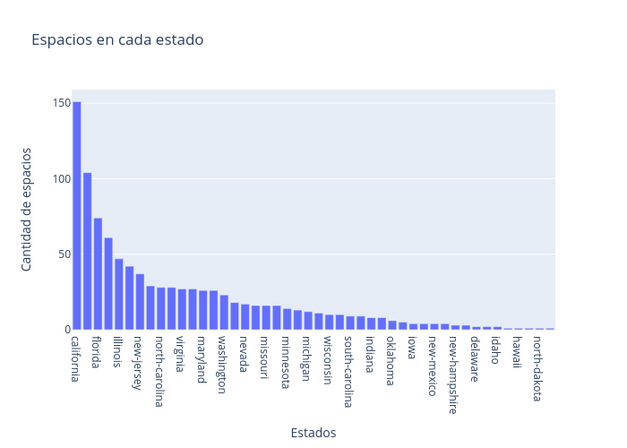

# Vistazo de la data scrapeada
Se tomaron solos los datos de estados unidos para esta muestra

<table border="1" class="dataframe">
  <thead>
    <tr style="text-align: right;">
      <th></th>
      <th>url</th>
      <th>title</th>
      <th>location</th>
      <th>google_maps</th>
      <th>features</th>
      <th>price_office_space</th>
      <th>price_coworking</th>
      <th>price_virtual_offices</th>
      <th>price_meeting_rooms</th>
      <th>image_1</th>
      <th>image_2</th>
      <th>image_3</th>
      <th>desc_h</th>
      <th>desc_p</th>
      <th>cnt_private_offices</th>
      <th>cnt_coworking_desks</th>
      <th>cnt_meeting_rooms</th>
      <th>latitude</th>
      <th>longitude</th>
      <th>country</th>
      <th>state</th>
      <th>city</th>
    </tr>
  </thead>
  <tbody>
    <tr>
      <th>0</th>
      <td>https://www.regus.com/en-us/united-states/california/redwood-city/303-twin-dolphin-drive-131</td>
      <td>303 Twin Dolphin Drive.</td>
      <td>303 Twin Dolphin Drive, Redwood City, CA 94065</td>
      <td>https://www.google.com/maps/dir//37.5235361034277,-122.258564390404</td>
      <td>City/Town Centre Accessible Major transport connections Meeting Rooms...</td>
      <td>385</td>
      <td>369.0</td>
      <td>95</td>
      <td>45</td>
      <td>https://assets.iwgplc.com/image/upload/CentreImagery/131/131_5.jpg</td>
      <td>https://assets.iwgplc.com/image/upload/CentreImagery/131/131_2.jpg</td>
      <td>https://assets.iwgplc.com/image/upload/CentreImagery/131/131_4.jpg</td>
      <td>A prestigious waterside setting</td>
      <td>With its favorable climate and great community spirit, Redwood City...</td>
      <td>18</td>
      <td>4</td>
      <td>37.523537</td>
      <td>-122.258568</td>
      <td>united-states</td>
      <td>california</td>
      <td>redwood-city</td>
    </tr>
    <tr>
      <th>1</th>
      <td>https://www.regus.com/en-us/united-states/georgia/atlanta/the-pinnacle-building-221</td>
      <td>The Pinnacle Building.</td>
      <td>The Pinnacle Building, Atlanta, GA 30326</td>
      <td>https://www.google.com/maps/dir//33.8504455417319,-84.3603915535294</td>
      <td>Major transport connections Meeting Rooms On-site Lunch Restaurant...</td>
      <td>265</td>
      <td>255.0</td>
      <td>49</td>
      <td>29</td>
      <td>https://assets.iwgplc.com/image/upload/CentreImagery/221/221_5.jpg</td>
      <td>https://assets.iwgplc.com/image/upload/CentreImagery/221/221_2.jpg</td>
      <td>https://assets.iwgplc.com/image/upload/CentreImagery/221/221_4.jpg</td>
      <td>Impressive office in renowned business district</td>
      <td>Atlanta Pinnacle boasts a prime downtown position on Peachtree Street...</td> 
      <td>86</td>
      <td>24</td>
      <td>4</td>
      <td>33.850445</td>
      <td>-84.360390</td>
      <td>united-states</td>
      <td>georgia</td>
      <td>atlanta</td>
    </tr>
    <tr>
      <th>2</th>
      <td>https://www.regus.com/en-us/united-states/north-carolina/durham/2530-meridian-parkway-266</td>
      <td>2530 Meridian Parkway.</td>
      <td>NC, Durham - RTP Meridian 2530 Meridian Parkway, Durham, NC 27713</td>
      <td>https://www.google.com/maps/dir//35.9112578969551,-78.8999671779098</td>
      <td>City/Town Centre Accessible Major transport connections Meeting Rooms...</td>
      <td>189</td>
      <td>179.0</td>
      <td>75</td>
      <td>19</td>
      <td>https://assets.iwgplc.com/image/upload/CentreImagery/266/266_5.jpg</td>
      <td>https://assets.iwgplc.com/image/upload/CentreImagery/266/266_2.jpg</td>
      <td>https://assets.iwgplc.com/image/upload/CentreImagery/266/266_4.jpg</td>
      <td>Modern design in a leading community</td>
      <td>Take advantage of our prime location just two minutes from the...</td> 
      <td>121</td>
      <td>13</td>
      <td>6</td>
      <td>35.911259</td>
      <td>-78.899963</td>
      <td>united-states</td>
      <td>north-carolina</td>
      <td>durham</td>
    </tr>
    <tr>
      <th>3</th>
      <td>https://www.regus.com/en-us/united-states/florida/miami/5201-blue-lagoon-drive-174</td>
      <td>5201 Blue Lagoon Drive.</td>
      <td>Waterford Business Park, Miami, FL 33126</td>
      <td>https://www.google.com/maps/dir//25.7834703719201,-80.2916260565631</td>
      <td>City/Town Centre Major transport connections Meeting Rooms...</td> 
      <td>299</td>
      <td>285.0</td>
      <td>95</td>
      <td>29</td>
      <td>https://assets.iwgplc.com/image/upload/CentreImagery/174/174_5.jpg</td>
      <td>https://assets.iwgplc.com/image/upload/CentreImagery/174/174_2.jpg</td>
      <td>https://assets.iwgplc.com/image/upload/CentreImagery/174/174_4.jpg</td>
      <td>Prime airport location</td>
      <td>Waste no time with an efficient work environment. Perfect for meetings...</td>
      <td>178</td>
      <td>26</td>
      <td>5</td>
      <td>25.783470</td>
      <td>-80.291626</td>
      <td>united-states</td>
      <td>florida</td>
      <td>miami</td>
    </tr>
    <tr>
      <th>4</th>
      <td>https://www.regus.com/en-us/united-states/california/el-segundo/400-continental-boulevard-248</td>
      <td>400 Continental Boulevard.</td>
      <td>400 Continental Blvd, El Segundo, CA 90245</td>
      <td>https://www.google.com/maps/dir//33.9209373731741,-118.390105331352</td>
      <td>City/Town Centre Accessible Gym and Fitness Room Major transport...</td>
      <td>359</td>
      <td>339.0</td>
      <td>109</td>
      <td>29</td>
      <td>https://assets.iwgplc.com/image/upload/CentreImagery/248/248_5.jpg</td>
      <td>https://assets.iwgplc.com/image/upload/CentreImagery/248/248_2.jpg</td>
      <td>https://assets.iwgplc.com/image/upload/CentreImagery/248/248_4.jpg</td>
      <td>Impressive architecture, close to household names</td>
      <td>Prepare to feel inspired at LAX Continental Grand, an imposing steel...</td>
      <td>147</td>
      <td>16</td>
      <td>3</td>
      <td>33.920937</td>
      <td>-118.390106</td>
      <td>united-states</td>
      <td>california</td>
      <td>el-segundo</td>
    </tr>
  </tbody>
</table>

## Descripcion de las carasteristicas de la data

### Features   -   Format
**url** - 'https://www.regus.com/en-us/[country]/[city]/[workspace]' \
**title** - string con el nomber del lugar o edificio\
**location** - '[street], [city], [postal code]' \
**google_maps** - 'https://www.google.com/maps/dir//[latitude]/[longitude]' \
**features** - caracteristicas del lugar separadas por saltos de linea ('\n')\
**price_office_space** - numero entero que indica el precio por persona por mes ([price]/person/month)\
**price_coworking** - numero entero que indica el precio por persona por mes ([price]/person/month)\
**price_virtual_offices** - numero entero que indica el precio por mes ([price]/month)\
**price_meeting_rooms** - numero entero que indica el precio por hora ([price]/hour)\
**image_1, image_2, image_3** - 'https://assets.iwgplc.com/image/upload/CentreImagery/[endpoint]' \
**desc_h** - string con el encabezado de la descripcion\
**desc_p** - string con el contenido de la descripcion\
**cnt_private_offices** - entero que indica la cantidad de oficinas privadas en el lugar\
**cnt_coworking_desks** - entero que indica la cantidad de escritorios en el lugar\
**cnt_meeting_rooms** - entero que indica la cantidad de habitaciones para reuniones en el lugar\
**latitude** - latitud en google maps\
**longitud** - longitud en google maps\
**country** - pais\
**state** - estado/provincia\
**city** - ciudad\

## Datos faltantes

### Proporcion de datos faltantes:
**features** 3.02%\
**price_coworking** 2.08%\
**city** 0.83%\
Esta proporcion de datos faltantes es bastante aceptable. Igualmente se pueden llenar de forma creativa

## Distribusion de espacios

## Demostracion rapida de texto a html
 

1)

<h3 class='subheader'>A prestigious waterside setting</h3>

With its favorable climate and great community spirit, Redwood City is attracting a cluster of global companies and ambitious startups. Twin Dolphin Drive lies halfway between San Francisco and San Jose, with easy access to the city and Silicon Valley via the freeway.

Step out onto the terrace to enjoy a break between meetings or enjoy peaceful, inspiring views over the city from your desk. The beautiful waterfront location means you’re not far from a scenic walk, with coffee shops and grills nearby.

<a href=https://www.google.com/maps/dir//37.5235361034277,-122.258564390404>view on map</a>

 

2)

<h3 class='subheader'>Impressive office in renowned business district</h3>

Atlanta Pinnacle boasts a prime downtown position on Peachtree Street in the state capital’s fashionable Buckhead district. The 22-storey glass skyscraper is close to the top-ranking Terry College of Business and less than 15 minutes from PDK airport.

Escape to the dramatic rooftop sky garden for inspiration or use the videoconferencing facilities in one of our colorful meeting rooms. The Pinnacle offers underground parking, its own restaurant and a multitude of trendy eateries and lively bars.

<a href=https://www.google.com/maps/dir//33.8504455417319,-84.3603915535294>view on map</a>

 

3)

<h2 class='subheader'>Modern design in a leading community</h2>

Take advantage of our prime location just two minutes from the world-famous Research Triangle Park. Just off the I-40 and only seven minutes from Raleigh-Durham International Airport, our Meridian Parkway Office Spaces are perfectly located.

Floor to ceiling windows in this modern building provide generous amounts of light and contribute towards a relaxed, professional business atmosphere. Amenities include an on-site café while the Research Park’s many bars and restaurants are situated just a short hop across the interstate.

<a href=https://www.google.com/maps/dir//35.9112578969551,-78.8999671779098>view on map</a>

